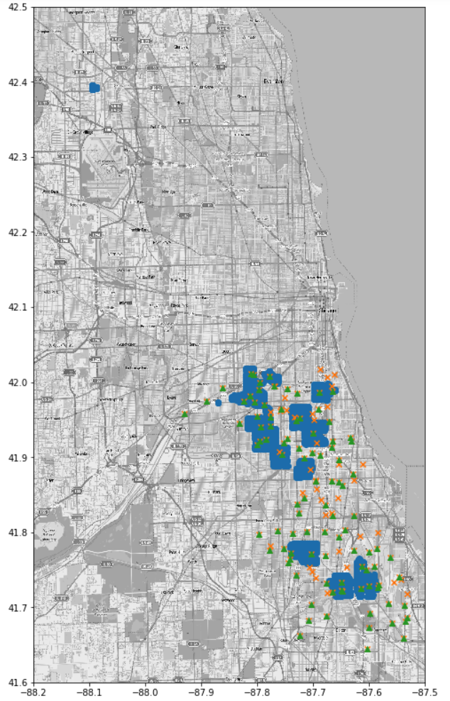
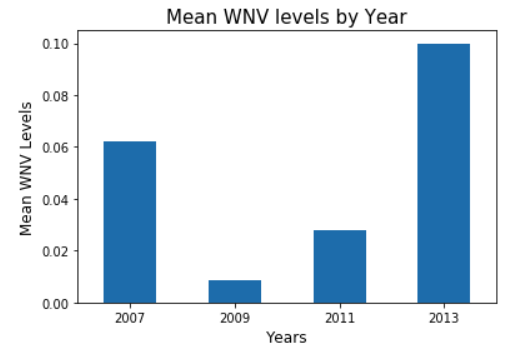
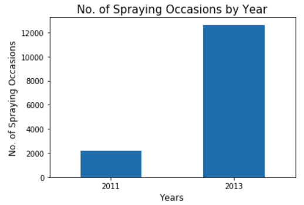

# Project4_West_Nile_Virus

## Context and Problem Statement
---

- [West Nile Virus (WNV)](https://www.cdc.gov/westnile/index.html) is the leading cause of mosquito-borne disease in the America. It is most commonly spread to people through the bite of an infected mosquito. Cases of WNV occur during the mosquito season, which begins in the summer and continues through autumn. There are no vaccines to prevent or medications to cure WNV in people. Around 1 in 5 people who are infected develop a fever and other symptoms, while about 1 out of 150 infected people develop a serious, sometimes fatal, illness.

- Our team is tasked to predict the existence of WNV given areas in Chicago, as well as conduct a cost-benefit analysis of deploying the spraying of pesticides.

- This will inform policy formulation and resource planning by the government to optimize protection of Chicago residents from the virus.

- Exploratory Data Analysis (EDA) will first be conducted on the various datasets provided. Train and Test data would be merged so that they could be cleaned together and columns standardized. Dates will be broken down into days, months, and years and dummies would be created for categorical features such as "Species", as well as specific features such as months, then weather data will be cleaned and merged to both train and test datasets, before finally splitting the dataset into train and test sets.

- The simplest and most widely used classification algorithm, Logistic Regression will first be trained and evaluated on the train set using cross_val_score to get a rough gauge of its performance, model will then be tuned, before more complex models such as bagging ensemble methods like Random Forest or boosting ensemble methods like XGBoost would be run on the train dataset to evaluate the same. 

- Chosen model will have its hyperparameters tuned using GridSearchCV and final deployment/production model will be evaluated using a mixture of ROC AUC and metrics such as recall in. As it is more important to capture as many wnv-prone spots as possible, there will be increased emphasis on the recall (sensitivity) metric when we evaluate our models. The model will also be used to predict WNV for the test data and the predictions generated will be submitted to Kaggle (metric used was ROC AUC) to compare against the public leaderboard. Our chosen model achieved a decent ROC AUC of ~0.69 on Kaggle.

- The details will be outlined in the following sections.

## Data Import and Cleaning
---
Train & Test Data
The training dataset contained no missing values. 
 

Weather Data

- Null values in the weather dataset were encoded as "M" or "-". For features where the occurence of "M"s/"-"s was low (<5%), we imputed the missing entries (StnPressure, SeaLevel, AvgSpeed, WetBulb) with their means. 
- When the number of missing values for a Station was high, we dropped the feature column for the particular station. Dropped Depart, Sunrise, Sunset in Station 2. Dropped Water1 and SnowFall in both stations.
- For PrecipTotal, the measure of the total precipitation for one day in inches, some values were encoded as "T"s, representing trace amounts of rain or snow (stated in documentation). We imputed a value of 0.00" for these trace entries. 
- CodeSum column describes the weather conditions for a given day.  Given that it contains qualitative information that are captured in other quantitative features like DewPoint,PercipTotal, we dropped CodeSum.
- Sunrise and Sunset are engineered to obtain daylight duration which is more meaningful to investigate.
- For rest of the features, average values between Stations 1 and 2 were obtained.

Spray Data

Data Merging

- We merged weather data with train and test datasets using the date column respectively.

## EDA
---

We created a number of plots to visually inspect our data, found in the Train-test, Weather and Spray notebooks. Key features that correlate with the presence of WNV are as follows:
1) There were more mosquitos with WNV found in traps on days with higher average temperatures and lower humidities.
2) Culex Pipiens mosquito species is more likely to carry WNV compared to other species.
3) Spray efforts made in 2011 and 2013 did not have significantly impact on WNV occurrance??

- The above shows regions where spraying efforts in 2011 and 2013 were concentrated (spraying patterns appear correlated over space-indicating spatial dependence), as well as where traps were deployed and where WNV was present in 2007, 2009, 2011, and 2013. The map plot seems to suggest that while some of the sprays were conducted on WNV-present areas, not all were covered. Particularly, the south-eastern region of chicago, middle portion, that contain traps with WNV present were not sprayed in 2011 and 2013.

- There appears to be a cluster of sprays concentrated in the top left-hand corner of the map plot (lat = ~42.4, long = ~ -88.1) that appears to be an "outlier" cluster... We delved deeper and noticed that it was a cluster of 95 spray instances all conducted on 29 Aug 2011 across various time points...There were no traps deployed there and no WNV present too... So why were those 95 spray instances conducted there?! 

- We delved deeper into the EDA to find out if mean WNV levels had fluctuated across the years (2007-2013).

Based on the above two barplots, there could be several interpretations - It could suggest that the spraying in 2011 did not help to curb WNV occurence which was why in 2013, the WNV occurence went up which led authorities to ramp up efforts in spraying, resulting in a higher number of spraying occasions in 2013. That said, there could be significantly more spraying occasions conducted in 2007 that resulted in WNV occurences declining considerably but we would not be able to confirm this due to the lack of 2009 data.  On the other hand, the barplots could also suggest that the effect of the pesticide sprays conducted each year is only effective within the year and thus comparisons across years could not be made - in which case, the barplots could be interpreted to mean that since there were few WNV occurences in 2011 compared to 2013, it is logical that there were more spraying occasions conducted in 2013 than in 2011. In summary, since we have insufficient years of spray data (2011, 2013 out of 2007-2014), we have excluded the subsequent use of spray data in the modelling process.

## Modelling
---

Baseline score: 0.95 of mosquitos trapped in Chicago in 2007, 2009, 2011 and 2013 did not carry wnv virus.

We tested several variations of classification models in an effort to maximize the receiver operating characteristic area under the curve (ROC AUC) as well as sensitivity (recall). The ROC AUC is used to evaluate the models' ability to predict whether WNV will be present in particular locations in Chicago on a certain date. The table below lists a selection of the tested models and their corresponding ROC AUC scores (and Kaggle scores?):

<Insert Priya's Table>

Our strategies:
1) Tested models with and without Principal Component Analysis (PCA) -- pending result from table
2) Given the highly unbalanced data, we tried two methods to address the issue - i) SMOTE; and ii) using the class balancing setting in classifiers. 

## Interpretation of Results

<pending result from table>

The 5 top factors that may impact the occurrance of wnv virus:
1) WetBulb
2) Tmin
3) AvgSpeed
4) Not sure if any species of mosquitos
etc.<Pending results>

The disparity between our local ROC AUC and Kaggle scores indicate that some of our models are either overfitting or modeling noise. It will be good if we could get more data with consistent time periods, as well as fuller data. Currently, data from train, weather and spray recorded different time periods and weather data has quite a bit of missing values. With more comprehensive data, perhaps more analyses (such as spatial and time series analyses) could be incorporated to yield more informative outcomes and more reliable predictions.

## Conclusions and Recommendations

Conclusions
We have developed a tuned Random Forest model that could predict whether WNV will be present in particular locations in Chicago on a certain date with a ROC AUC accuracy of 0.69. Its sensitivity is also highest among the models experimented upon.

Most of the top factors affecting the occurrance of WNV are weather features (e.g. wind speed, humidity, temperature). Other than spraying, it is challenging to alter the external environment to reduce wnv virus. <pending results>

Recommendations:
1) To spray as often as possible, with high coverage of the city.
2) If spray cost is an issue, target areas with high population.

Cost-Benefit Analysis:
- Cost: Cost of spraying (e.g. manhours, cost of spray, logistics), cost of medical insurance to treat wnv infected residents (assume government insurance provided to residents)
- Benefit: Lesser infected residents translates to lower medical expenditure on Government. Healthier residents translates to happier residents who will vote for government.
- All in all, it is of paramount importance to safeguard the health of the residents of Chicago (which is why we focused on the sensitivity metric as mentioned above) against the WNV. Therefore, even if more costs is to be incurred, the long-term benefits reaped of a disease-free population that does not decline due to WNV will eventually outweigh the short-term costs.
    
## Source(s)

- https://www.cdc.gov/westnile/index.html

